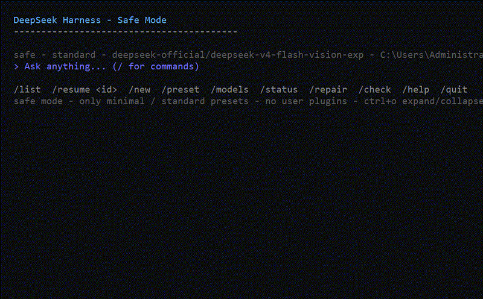

# dsh-safe-tui

[English](README.en.md)

DeepSeek Harness 安全模式 / 修复模式，并可在 DSH Web 中作为“控制台”Tab 使用。

## Demo



## 它是什么

当主 Web UI 因为插件/客户端补丁损坏而无法打开时，用这个独立的终端可以：

- 不加载任何用户插件、不加载 Web UI；
- 不发现用户自建预设（`includeUserRoot: false`），交互上只允许官方系统预设：`minimal` / `standard` / `code` / `cordis`；
- 继承 `~/.dsh/sessions` 里的历史会话（`/sessions`）；
- 从内置 pristine 副本自动修复已损坏的官方客户端文件（`/repair` 或独立 Repair 快捷方式）。

> 定位区别：`dsh-safe-tui` 是**安全模式/修复专用** TUI，不加载用户插件、不加载 Web、只允许官方系统预设（minimal/standard/code/cordis），用于主界面打不开时修理系统。它不是日常体验增强型 TUI（例如社区里的 `ccch1mneyyy/dsh-TUI`），二者定位不同、可以互补。

## Web 控制台

自 v0.5.0 起，`dsh-safe-tui` 还提供一个 **Web Console** 模式：

- 在 DSH Web 的 **“对话 | 轨迹”** Tab 最右侧新增 **“控制台”**。
- 点击后打开一个真正的 xterm.js 终端，后端通过 `node-pty` 启动 `dsh --profile safe`。
- 效果和 PowerShell/终端一致，可以完整使用 Safe TUI 的 `/sessions`、`/new`、`/preset`、`/repair` 等命令。
- 当 Web 对话因插件错误无法加载时，左侧栏仍可用，可直接切到“控制台”继续操作 DSH。

## 使用

桌面已创建两个入口：

- **DeepSeek Harness Safe Mode**：进入安全终端（现代化全屏 TUI）。
- **DeepSeek Harness Repair**：只运行修复脚本，不需要 DSH 启动。

也可以手动运行：

```bat
deepseek                       :: 直接进入全屏 TUI
dsh --profile safe
dsh --profile safe "你的问题"   :: 一次性问答
dsh --profile safe --list
dsh --profile safe --resume <sessionId>
dsh --profile safe --check
dsh --profile safe --repair
node "%USERPROFILE%\dsh-safe-tui\lib\repair.js" --repair
```

安全终端内命令：

```
/help /sessions /sessions all /new /preset [minimal|standard|code|cordis] /models /models <provider/model> /providers /add-provider /status /repair /clean /check /quit
```

官方系统 preset 的含义：

- `minimal` — 极简模式：仅持久 bash + `str_replace_editor` 双工具编码 Agent。
- `standard` — 标准模式：完整编码 Agent，含文件编辑、Shell、检索、Skills、计划、目标、子代理、工作流。
- `code` — PTC 模式：标准全部能力 + Code Mode SDK，用 TypeScript 程序组合多步操作。
- `cordis` — 创造模式：标准全部能力 + 运行时检查、插件实验和 preset 创作指导（可修改/创建 preset）。

- `/sessions` 采用 OpenCode 风格的 Sessions 选择器：可直接输入过滤，按 Today/Yesterday/日期分组，行尾显示工作区目录，当前会话带 `●` 标记；按 `Ctrl+X` 两次可删除选中会话。
- `/clean` 或 `dsh --profile safe --clean` 会删除所有没有 AI 生成内容的空会话。
- 对话生成中按 **`Ctrl+C`** 或 **`Esc`** 可强制取消当前回合，模型会停止并回到输入状态。
- 在 `/preset` 选择器中按 `i` 或 `?` 可查看当前高亮预设的详细说明，再按一次收起。
- 输入框为空时，`↑` / `↓` 或 `PgUp` / `PgDn` 可上下浏览会话历史；输入状态下 `↑` / `↓` 仍为命令历史。
- 模型思考与工具调用默认折叠为一行，按 `Ctrl+O` 可展开/收起全部详情；鼠标滚轮也可上下滚动历史。
- 可以在已有会话中切换 `preset`（会提示旧工具调用可能不兼容）。

## 从插件市场 / GitHub 安装

插件本身是自包含的 DSH bundle，包含 `agent-presets` + `safe-tui`，无需手动建 profile：

```bash
# 从 GitHub 安装并初始化 safe profile
dsh plugin --profile safe add github:aorucshiea/dsh-safe-tui#v0.4.16
```

之后可以直接运行：

```bash
dsh --profile safe
```

或者如果 `deepseek` 命令可用（npm 安装会自动提供，或把仓库里的 `deepseek.cmd` 复制到 PATH）：

```bash
deepseek
```

`deepseek` 会直接打开同一个全屏 TUI。

仓库：<https://github.com/aorucshiea/dsh-safe-tui>

## 关键文件

- `cordis.patch.yml` — bundle 补丁，挂载 `safe-tui` 插件。
- `lib/index.js` — 交互式/一次性安全终端插件。
- `lib/repair.js` — 无需 DSH 即可独立运行的修复脚本。
- `pristine/` — 从官方 `0.1.0-rc.6` 提取的原始文件，用于恢复。
- `~/.dsh/profiles/safe/` — 安全 profile，只有 `dsh-base` + `dsh-safe-tui`。
